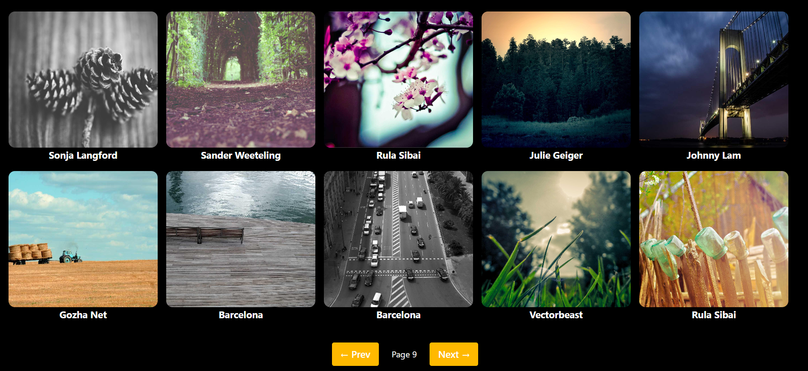

# 📸 React Gallery App

A modern image gallery built with **React**, **Axios**, and **Tailwind CSS**.  
It fetches photos from the **Picsum API**, displays them in a responsive grid, and supports smooth pagination with loading states.

---

## ✨ Features

- 📷 Image gallery with clean card layout
- 🔄 Pagination (Next / Prev)
- ⏳ Loading state with overlay (no layout jump)
- 🎨 Responsive UI using Tailwind CSS
- 🧩 Component-based architecture
- 🌐 External image links (open in new tab)

---

## 🛠 Tech Stack

- **React**
- **Axios**
- **Tailwind CSS**
- **Picsum Photos API**

---

## 📂 Project Structure
src/
├── components/
│ ├── Card.jsx
│ ├── Gallery.jsx
│ └── Pagination.jsx
├── App.jsx
└── main.jsx

# Here are some sample images of Gallery App

