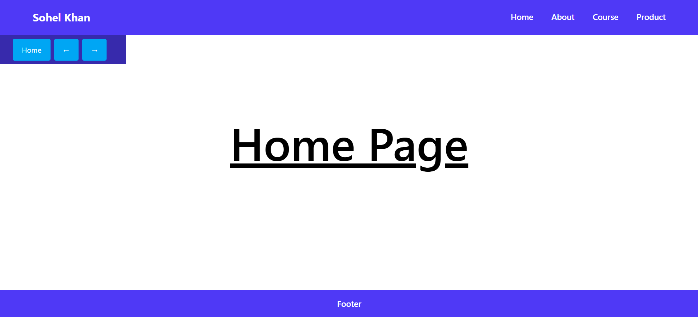

# React Router DOM Practice Project

This project is a simple React application built to understand and practice **React Router DOM**.  
It demonstrates client-side routing, basic layout structure, and styling using **Tailwind CSS**.

The main focus of this project is learning how navigation works in React without page reloads.

---

## 🚀 Features

- Client-side routing using React Router DOM
- Multiple pages (Home, About, Course, Product)
- Reusable layout components (Navbar, Footer)
- Clean and simple UI
- Styled with Tailwind CSS

---

## 🛠 Tech Stack

- React
- React Router DOM
- Tailwind CSS

---

## 📂 Project Structure
src/
├── components/
│ ├── Navbar.jsx
│ ├── Navbar2.jsx
│ └── Footer.jsx
│
├── pages/
│ ├── Home.jsx
│ ├── About.jsx
│ ├── Course.jsx
│ ├── CourseDetails.jsx
│ ├── Product.jsx
│ ├── Men.jsx
│ ├── Women.jsx
│ ├── Kids.jsx
│ └── NotFound.jsx
│
├── App.jsx
├── main.jsx
└── index.css

# 🧭 Learning Objectives

- Understand how React Router DOM works
- Use BrowserRouter, Routes, and Route
- Navigate between pages without reloading
- Create shared layouts across pages
- Apply basic styling with Tailwind CSS

# sample Image
